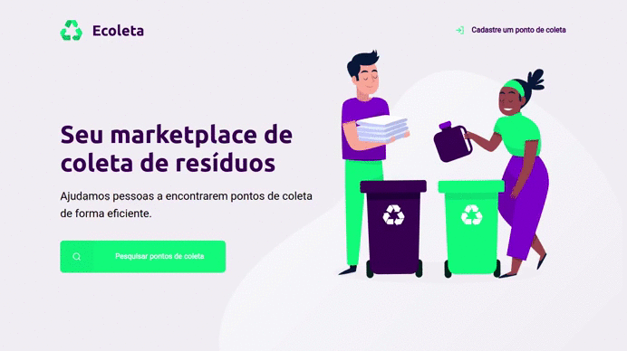
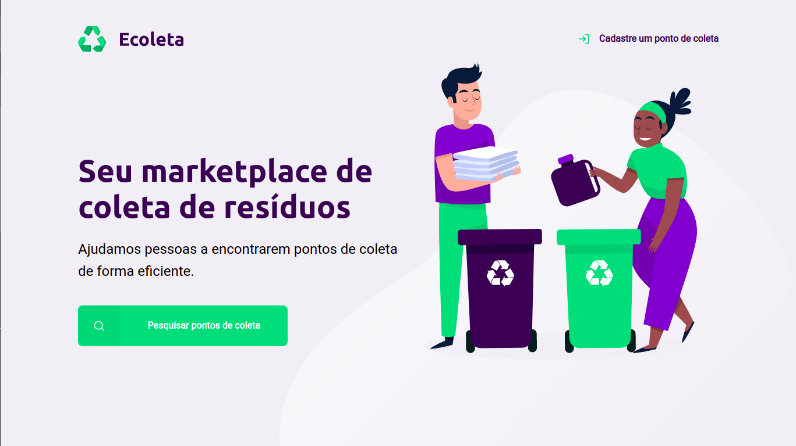

# Ecoleta

## 🗒️ Sobre a aplicação

Essa é apenas uma página estática para uso no trabalho de criptografia SSL/TSL da disciplina de Segurança da informação.

## 🔥 Prévia da aplicação

Tela principal

Buscar pontos

Tela de cadastro

## 🔨 Iniciando a aplicação

## ...
